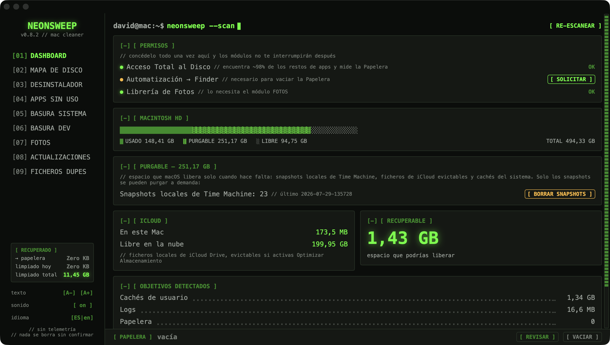
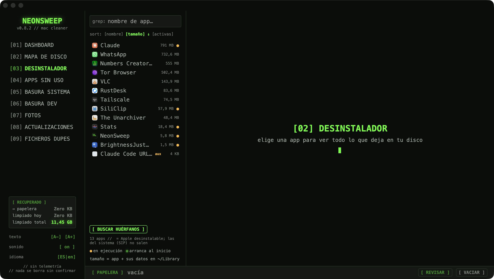
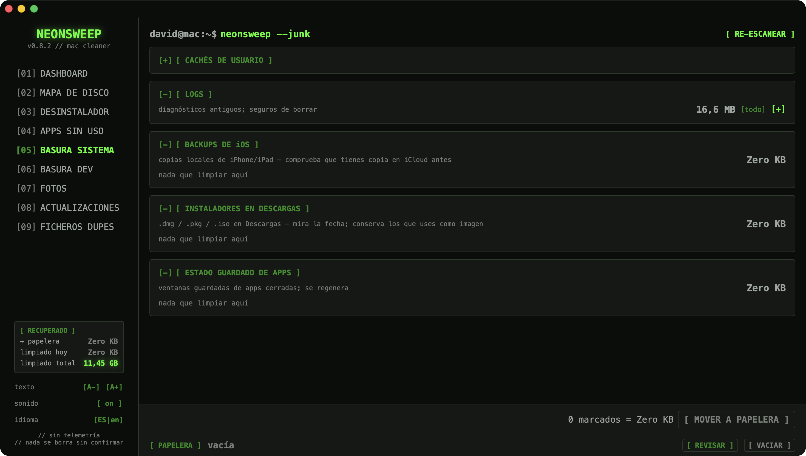

# 🧹 NeonSweep

> A retro neon-terminal Mac cleaner. Free, open source, no telemetry, nothing deleted without asking.

**NeonSweep** is a native macOS app (Swift + SwiftUI, official Apple APIs only) inspired by CleanMyMac and Gemini 2, with a black / grey / neon-green terminal aesthetic. English & Spanish.

*Limpiador de Mac nativo con estética retro-terminal neón. Gratis, open source, sin telemetría, y nada se borra sin confirmar. Interfaz en español e inglés.*

## Screenshots


*Dashboard — disk usage, purgeable space macOS hides, and reclaimable-space targets.*

| | |
|---|---|
|  |  |
| **Uninstaller** — apps + every leftover, with orphan scan | **System junk** — caches, logs, iOS backups, installers |

## Modules / Módulos

| # | Module | What it does |
|---|--------|--------------|
| 01 | **DASHBOARD** | Disk usage incl. **purgeable** space Finder hides, iCloud quota (`brctl`), reclaimable-space targets |
| 02 | **DISK MAP** | Squarified treemap of your home folder — area is size, click to drill in, breadcrumbs to climb back out |
| 03 | **UNINSTALLER** | Pick an app, see every leftover it dropped in `~/Library` (bundle-ID matching, 14 locations), move it all to Trash. Also finds **orphaned leftovers** from apps you deleted long ago (reverse vendor-prefix matching) and system-level (`/Library`) leftovers, deletable via a single admin authorization |
| 04 | **UNUSED APPS** | Apps you have not opened in months (Spotlight last-used date), ranked by size; jumps straight to the uninstaller |
| 05 | **SYSTEM JUNK** | User caches, logs, iOS backups (with device name & date), old installers, saved app state |
| 06 | **DEV JUNK** | Xcode DerivedData & DeviceSupport, simulators, Docker/Colima/OrbStack, 15 package-manager caches, `node_modules`/venvs of projects untouched for 15–365 days (you pick) |
| 07 | **PHOTOS** | Duplicate & similar groups (Vision feature prints, 3 tiers, user-pickable BEST), twin-video comparison, plus the killer feature: **RAW → HEIC** (parallel, ~94% savings, EXIF intact) and **video → HEVC** with minimum / optimum / maximum profiles, a conversion queue, and a registry so it never recompresses its own output. Incremental analysis with resume checkpoints; import → verify → delete safety flow |
| 08 | **UPDATES** | Pending Homebrew formulae/casks and App Store updates (via `mas`), upgradeable per package or all at once |
| 09 | **FILE DUPES** | Exact file duplicates via streaming SHA-256 across iCloud Drive / Home / Downloads / Documents (size pre-grouping, hard links counted once, not-downloaded files skipped) — keeps the shortest path per group |

## Safety model / Modelo de seguridad

- Nothing is preselected aggressively; **you** check what goes.
- Everything goes to the **macOS Trash** (restorable from Finder) or to Photos' **Recently Deleted** (30 days).
- Emptying the Trash is the only irreversible action — amber-coloured, double-confirmed, done via Finder (Apple Events).
- Reclaimed-space counters distinguish *"→ trash"* (recoverable) from *"cleaned"* (truly freed).
- Official Apple APIs only: FileManager, NSWorkspace, PhotoKit, Vision, AVFoundation, Core Image.

## Build

Requires macOS 15+ and Swift 6 (Command Line Tools are enough — no Xcode needed):

```sh
./build-app.sh          # → build/NeonSweep.app
open build/NeonSweep.app
```

Dev loop: `swift build && swift run`. Tests: `swift test`. Open a specific module directly (handy for demos): `swift run NeonSweep -- --module photos`.

### Command line

There is a report mode, and only a report mode:

```sh
/Applications/NeonSweep.app/Contents/MacOS/NeonSweep --report          # human readable
/Applications/NeonSweep.app/Contents/MacOS/NeonSweep --report --json   # for scripts
```

It prints disk usage and reclaimable space per category, then exits. **It never deletes anything.** There is no `--clean` flag and there won't be one: every module here is built around looking at the list before agreeing to it, and a cleaner that empties folders unattended from a cron job is exactly the kind of tool that breaks Macs. Use `--report` to watch, open the app to act.

`--bench-video <file> [seconds]` measures the video transcoder against a loose file — never the photo library, where converting deletes the original. It reports decode-only cost, speed-priority encoding and N concurrent jobs, and is how the "parallel does not help" claim below was established.

### Releases

Tagging `vX.Y.Z` builds the app, publishes the DMG, and bumps the Homebrew cask in [davic80/homebrew-neonsweep](https://github.com/davic80/homebrew-neonsweep) — computing the sha256 from the *published* DMG, not the freshly built one. The cask step needs a `HOMEBREW_TAP_TOKEN` secret (a fine-grained PAT scoped to the tap with Contents: Read and write); without it the step is skipped with a warning and the cask is updated by hand.

### Install / Instalación

```sh
brew install --cask davic80/neonsweep/neonsweep
```

The identifier has **three** parts: `user/repo/cask`. `brew install --cask davic80/neonsweep` fails, because two parts are read as a bare cask name Homebrew can't find. The three-part form taps and installs in one go. If you'd rather tap first:

```sh
brew tap davic80/neonsweep
brew install --cask neonsweep
```

Or download the DMG straight from [Releases](https://github.com/davic80/neonsweep/releases).

#### First launch — macOS Gatekeeper / Primer arranque

NeonSweep is open source and signed **ad-hoc (not notarized)**, so the first time you open it macOS says it *"cannot be opened because Apple cannot check it for malware"*. This is expected. To allow it:

- **EN** — Open **System Settings → Privacy & Security**, scroll to the bottom, and next to the NeonSweep message click **"Open Anyway"**, then confirm. You only do this once.
- **ES** — Abre **Ajustes del Sistema → Privacidad y seguridad**, baja hasta el final y, junto al mensaje de NeonSweep, pulsa **"Abrir igualmente"** y confirma. Solo hay que hacerlo una vez.

Or from Terminal: `xattr -dr com.apple.quarantine /Applications/NeonSweep.app`

## Permissions / Permisos

macOS will ask as features are used: folder access (TCC), Automation → Finder (empty Trash), Photos library (module 05). For full leftover coverage, grant **Full Disk Access** in System Settings.

## License

[MIT](LICENSE) — © 2026 David Cornejo
